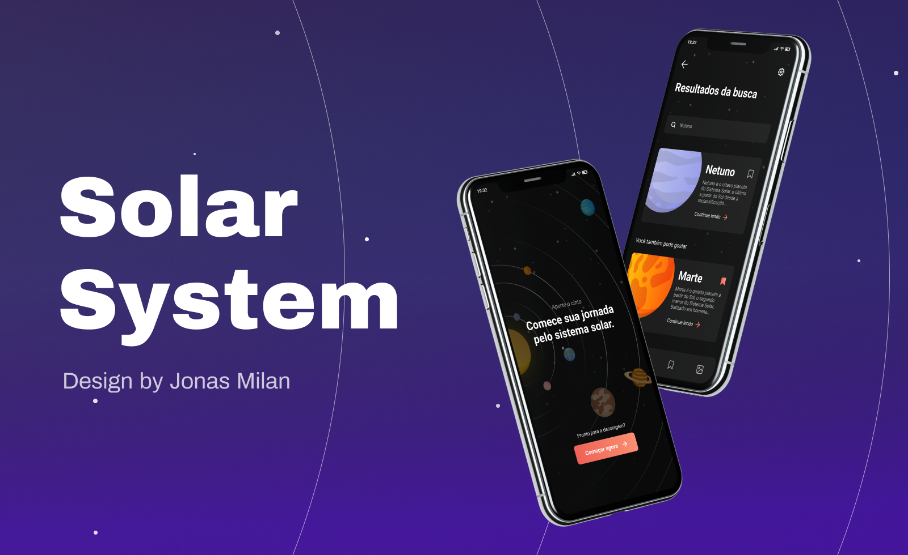

<h1 align="center">Solar</h1>

  <a href="#-tecnologias">Tecnologias</a>&nbsp;&nbsp;&nbsp;|&nbsp;&nbsp;&nbsp;
  <a href="#-projeto">Projeto</a>&nbsp;&nbsp;&nbsp;|&nbsp;&nbsp;&nbsp;
  <a href="#-layout">Layout</a>&nbsp;&nbsp;&nbsp;|&nbsp;&nbsp;&nbsp;
  <a href="#-como-executar">Como executar</a>&nbsp;&nbsp;&nbsp;|&nbsp;&nbsp;&nbsp;
  <a href="#-licença">Licença</a>

  

 

 

<h4 align="center"> 
	🚧   🚀 Em construção...  🚧
</h4>

  

## ✨ Tecnologias

Esse projeto foi desenvolvido com as seguintes tecnologias:

- [React Native](https://facebook.github.io/react-native/)

## 💻 Projeto

Sejam bem-vindos ao Solar System! Este é o terceiro projeto da **umpontoseis** criado de designers para desenvolvedores, que traz com ele o intuito de aperfeiçoar nossas habilidades e estreitar os laços profissionais.

E como sou um amante de Astronomia e Tecnologia quando encontrei esse projeto fiquei feliz e empolgado para implementar e compartilhar.

## 🔖 Layout

Você pode visualizar o layout do projeto através [desse link](https://www.figma.com/file/DVJJectlyEirYoAOJyxmQn/Solar-System---Jonas-Milan-(Community)?node-id=149%3A0). É necessário ter conta no [Figma](https://figma.com) para acessá-lo.

**Observação:** O layout foi desenvolvido pelo [Jonas Milan](https://www.linkedin.com/in/jonas-milan-8b68b3b2/), Vencedor do `<Design in Code/>`.

## 🚀 Como executar

- Clone o repositório
- Instale as dependências com `yarn install`
- Rode `yarn start` e em seguida rode `yarn android`

A aplicação pode ser acessada em [`localhost:3333`](http://localhost:3333).

## 📄 Licença

---
<h5 align="center">Feito com ♥ by Bruno Sousa 👋🏻 </h5>

